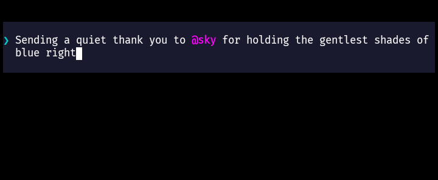

# rehd-input

An interactive, multi-line CLI input prompt built with Node.js featuring 2D arrow navigation, custom token highlighting, history management, and customizable background styling.



## Quick Start

### ES Modules (ESM)

```javascript
import TextInput from "rehd-input";

const answer = await TextInput({
  placeholder: "Type a message...",
});

console.log(answer);
```

### CommonJS (CJS)
```javascript
const TextInput = require("rehd-input").default;

async function run() {
  const answer = await TextInput({
    placeholder: "Type a message...",
  });

  console.log(answer);
}

run();
```

## Installation
```bash
npm install rehd-input
```

## Options & Configuration
TextInput(prefixOrOptions?, options?) accepts either a string prefix or a full options object.

```typescript
const answer = await TextInput({
  prefixText: "❯",
  prefixColor: "cyan",
  required: true,
  placeholder: "Type a message or mention @user...",
  history: ["previous input 1", "previous input 2"],
  MAX_HISTORY_SIZE: 10,
  styles: {
    backgroundColor: "#121212",
    colorPrefixBg: true,
    paddingTop: 1,
    paddingBottom: 1,
    paddingRight: 2,
    marginHorizontal: 1,
    marginVertical: 1,
    wordHighlight: {
      prefix: "@",
      color: "blue",
    },
  },
});
```

### Reference
| Option | Type | Default | Description |
|---|---|---|---|
| prefixText | string | "❯" | Text symbol displayed at the start of the prompt. |
| prefixColor | string | function | undefined | Foreground color/style for the prefix. |
| placeholder | string | "Enter your message..." | Text shown when input buffer is empty. |
| required | boolean | true | Prevents submission when input is empty. |
| history | string[] | [] | Past inputs loaded into Up/Down arrow navigation. |
| MAX_HISTORY_SIZE | number | 10 | Maximum items retained in history. |
| styles | InputStylesConfig | {} | Layout spacing and color styling properties. |

#### Style Options (styles)
| Style Property | Type | Default | Description |
|---|---|---|---|
| backgroundColor | string | function | "#121212" | Full-width container background color (Chalk name, hex, or style fn). |
| colorPrefixBg | boolean | true | Whether to extend the background color behind the prefix. |
| paddingTop | number | 1 | Empty background lines above input content. |
| paddingBottom | number | 1 | Empty background lines below input content. |
| paddingRight | number | 1 | Character padding on the right edge. |
| marginVertical | number | 1 | Unstyled blank lines above and below container. |
| marginHorizontal | number | 0 | Unstyled column margin on left/right edges. |
| wordHighlight | object | { prefix: "@", color: "blue" } | Defines token prefix character and highlight style. |

## Keyboard Shortcuts
 * **Enter**: Submit prompt.
 * **Shift + Enter / Alt + Enter**: Insert a new line (multi-line editing).
 * **Up / Down Arrows**: 2D grid line movement or cycle through history when on top/bottom rows.
 * **Left / Right Arrows**: Character navigation.
 * **Home / End (Ctrl+A / Ctrl+E)**: Jump to start/end of input.
 * **Ctrl + C**: Cancel and safely exit prompt.
